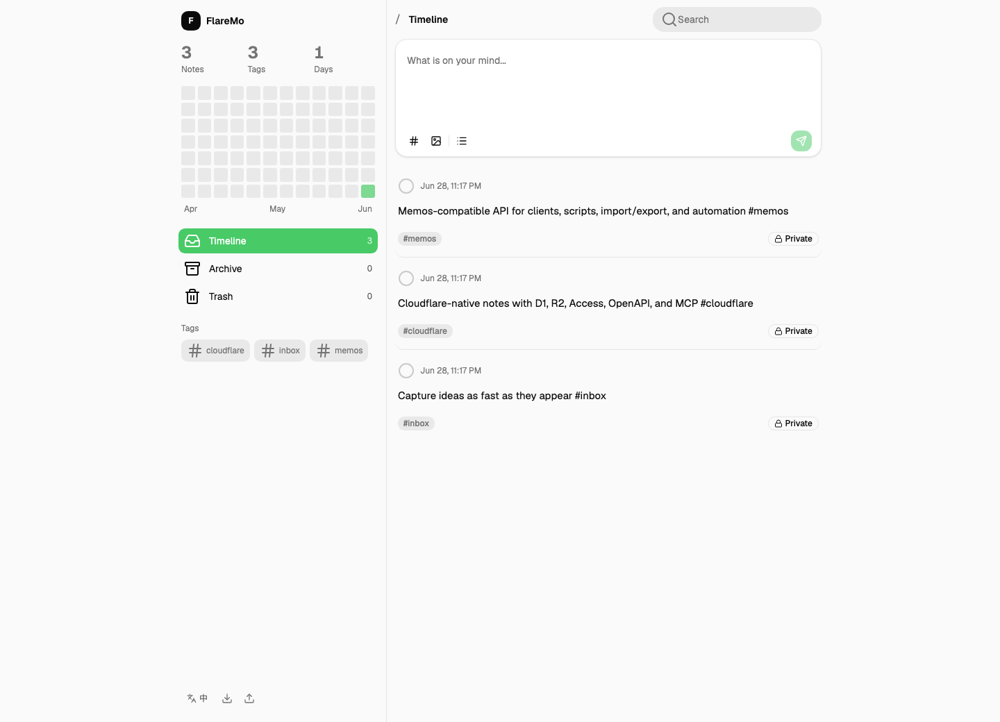
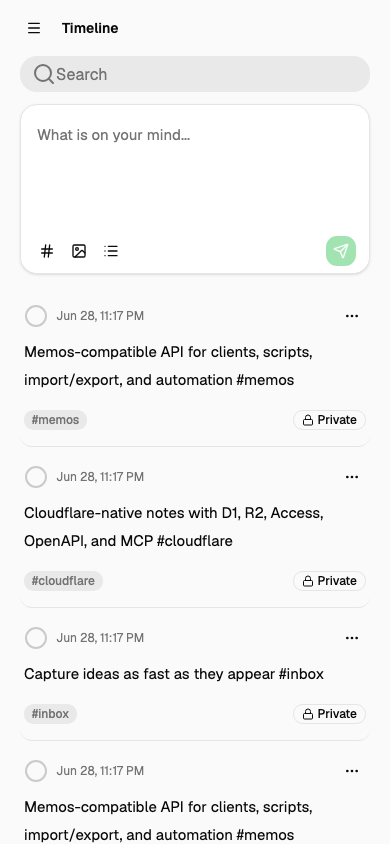
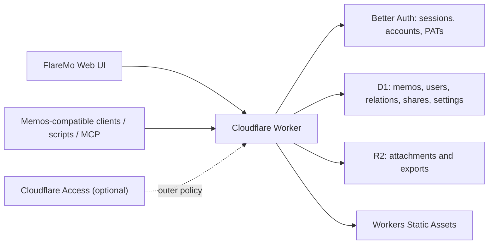

# FlareMo

**一个免费账号就能 24 小时跑在云端的个人笔记系统。Cloudflare 原生部署，自带数据库和对象存储，应用层使用 Better Auth 原生登录，对外保留 Memos 兼容 API；Cloudflare Access 可以作为可选外层防线。**

[](https://github.com/realchendahuang/FlareMo)
[](./LICENSE)
[](https://www.cloudflare.com/)
[](https://github.com/usememos/memos)

[English](./README.en.md)

[](https://deploy.workers.cloudflare.com/?url=https://github.com/realchendahuang/FlareMo)

<p>
  
  
</p>

截图展示的是当前已接上后端的时间线、编辑、筛选和移动端导航体验；未实现的 AI 回顾、语义搜索、微信输入等能力不会出现在界面里。

---

## 为什么做这个项目

Flomo 证明了「快速记录 + 安静时间线」这种轻量笔记体验是有价值的。但自部署这类系统通常意味着一台 VPS、一个 Postgres、一堆 Docker 容器、一份每周要维护的备份脚本，以及硬盘哪天坏了数据全没的风险。

FlareMo 想回答另一个问题：**能不能只用一个免费 Cloudflare 账号，不买服务器、不装数据库、不写备份脚本，就拥有一个 24 小时在线、数据不会丢、可以自定义域名、还能被各种工具调用的个人笔记系统？**

答案是可以。Cloudflare 免费账号就能提供：

- **Cloudflare D1：5 GB 数据库** —— 用来存笔记、标签、关系、分享、设置。
- **Cloudflare R2：10 GB 对象存储** —— 用来存附件、图片、导出包。
- **Cloudflare Workers：免费请求额度，全球边缘节点** —— 代码和前端都在离你最近的地方跑。
- **Better Auth 原生认证** —— 一次性设置用户名和密码，浏览器使用安全 cookie session，脚本和 Memos 客户端使用可撤销的 `memos_pat_` PAT；Cloudflare Access 可继续作为外层防线。
- **Workers Static Assets** —— 前端和 API 由同一个 Worker 提供，一次部署全搞定。

整套系统跑在一个 Worker 上。你没有一个「服务器」要照看，只有一份代码和一个免费账号。

---

## 这点免费额度到底够用多少

很多人对 5 GB 数据库 / 10 GB 对象存储没概念，觉得「免费」就是「不够用」。实际上对个人笔记这种写入量极低、纯文本为主的场景，免费额度是溢出的。

**5 GB D1 数据库：**

- 一条普通笔记（含标签、时间戳、索引开销）算 2 KB，5 GB 可以存约 **250 万条笔记**。
- 即使你每天写 100 条，也能写 **68 年**。
- 实际上绝大多数人一辈子也写不到 5 GB 的纯文本笔记。

**10 GB R2 对象存储：**

- 一张手机压缩后约 1–2 MB，10 GB 约可存 **5000–10000 张图片**。
- 或者约 **80 小时**的中等码率语音备忘录。
- R2 的出口流量不收费，分享给别人看图也不会产生流量账单。

换句话说，免费额度不是一个「很快就会撞到」的天花板，而是一个「你大概率永远用不完」的容量。

---

## 为什么放在 Cloudflare 上比放 NAS 更稳

自部署还有一个常被低估的成本：**数据的物理安全**。

- **NAS / 自建服务器**：数据在你自己家里的硬盘上。硬盘会坏，电源会跳，家里可能漏水、可能被盗、可能搬家时磕碰。哪怕你做 RAID，也只是延缓单盘故障，挡不住整台机器或整个房间出事。异地备份需要你另外搭一套。
- **Cloudflare**：D1 和 R2 的数据由 Cloudflare 在企业级基础设施上持久化，自带冗余。你不用买第二块硬盘，不用写定时备份脚本，不用关心磁盘 SMART 报警。Cloudflare 不会因为你家停电而丢数据。

这不代表你不用做导出——FlareMo 支持 Memos 格式导出包，重要数据本地留一份永远是好习惯。但日常的「会不会哪天醒来笔记全没了」这种焦虑，Cloudflare 帮你挡掉了。

除此之外，Cloudflare 还附带了自部署很难同时凑齐的几样东西：

- **全球边缘网络**：你和朋友在不同国家，访问都走最近的节点。
- **免费 HTTPS 和自定义域名**：绑个域名就行，证书自动续。
- **不用打洞**：不用 frp、不用 Tailscale、不用公网 IP，分享链接直接发给别人就能开。
- **零运维**：没有系统要打补丁，没有数据库要升级，没有进程要看门狗。

---

## 现在能做什么

- 快速记录笔记，支持标签和附件。
- 时间线、归档、回收站。
- D1 FTS5 全文搜索、标签筛选、活动热力图；默认搜索时间线与归档，搜索支持 `has:attachment`、`is:pinned`、`before:YYYY-MM-DD`、`after:YYYY-MM-DD` 和 `in:timeline|archive|trash`。
- 可安装的 PWA；新建笔记草稿自动保存在本机，离线提交（包括附件）进入本机待同步队列，重新联网后按顺序提交。
- Markdown/GFM、图片与音频附件预览。
- 记录详情、引用关系、反向链接和历史版本恢复。
- 可撤销的公开分享链接。
- 支持冲突策略的 Memos 数据导入导出。
- Memos current camelCase / protobuf-JSON 风格的 `/api/v1` memo、attachment、relation、share、social、auth facade 和 PAT 资源子集；Connect JSON/protobuf/gRPC-Web 还覆盖单用户 UserService 的 webhook CRUD/signing-secret 与 notification list/update/delete（含 comment/mention payload）；旧 snake_case wire 通过显式 header 保留。
- OpenAPI 输出。
- MCP 端点。
- 中英文界面。

前端只保留当前已经接上能力的入口。AI 回顾、语义搜索、随机漫步、微信输入这类功能还没实现，就不会挂在界面里占位置。

---

## 部署：一键或让 Agent 替你做

FlareMo 的部署被刻意做得很轻。两种方式，挑一种就行。

**方式一：一键部署按钮**

点击上方「Deploy to Cloudflare」按钮，Cloudflare 会读取 `wrangler.jsonc`，自动创建 Worker、生成 D1 / R2 绑定并通过部署命令应用 D1 migrations。把 `FLAREMO_DEPLOY_REPOSITORY` 填成 Cloudflare 创建的 GitHub 仓库（例如 `octocat/flaremo`），应用内就能直接打开该仓库的更新 workflow。

如果你的 Cloudflare Dashboard 还没有连接 GitHub 或 GitLab，Cloudflare 会先要求连接 Git provider。这个 OAuth 授权由你在 Cloudflare 页面里确认，和 FlareMo 的 Better Auth 登录是两件事；FlareMo 不会要求把任何真实凭据写进仓库。

**方式二：让 AI Agent 替你部署**

仓库里带了一份 [docs/agent-deploy.md](./docs/agent-deploy.md)，是写给 Codex / Claude Code / Cursor 这类 Agent 用的部署 runbook。把仓库交给一个能跑命令的 Agent，它就能按 runbook 创建 D1 / R2 资源、填写 `database_id`、跑迁移、部署。你不用记命令，Agent 自己按步骤来。

需要让 Agent、Telegram 或其他 IM 渠道直接写入笔记时，参考 [Agent 与 IM 渠道写入](./docs/agent-ingestion.md)。仓库提供一个经过测试的独立 Telegram Worker 示例，不会把渠道密钥或平台逻辑塞进 FlareMo 主 Worker。

**手动部署**（想自己一步步来的话）先创建资源：

```bash
pnpm exec wrangler d1 create flaremo
pnpm exec wrangler r2 bucket create flaremo-attachments
```

把 D1 输出的 `database_id` 写入 `wrangler.jsonc`，再执行：

```bash
pnpm verify
pnpm deploy:dry-run
pnpm deploy
```

完整部署说明见 [docs/deploy.md](./docs/deploy.md)，版本更新见 [docs/update.md](./docs/update.md)。Deploy Button 的实测记录见 [docs/deploy-button-test.md](./docs/deploy-button-test.md)。

**部署前检查清单**

- Wrangler 已登录目标 Cloudflare 账号：`pnpm exec wrangler whoami`。
- `wrangler.jsonc` 里的 D1 binding 是 `DB`，并已填入目标 D1 的 `database_id`。
- `wrangler.jsonc` 里的 R2 binding 是 `ATTACHMENTS`，目标 bucket 已创建。
- `pnpm deploy` 会先应用尚未执行的远端 D1 migrations，再发布 Worker。
- `wrangler.jsonc` 已设置生产 `FLAREMO_PUBLIC_URL`，并通过 Wrangler secret 配置 Better Auth secrets。
- 已完成一次性 owner bootstrap、原生登录和 PAT 创建验证；如果启用 Cloudflare Access，也已验证外层 policy 与应用层认证同时通过。
- Cloudflare Access application（可选）已规划好人类访问、Service Token 和公开分享 bypass。
- 发布前已跑：`pnpm verify` 和 `pnpm deploy:dry-run`。

---

## 登录：Better Auth 原生认证，Access 可选

FlareMo 的应用层认证由 Better Auth 提供。第一次部署时由部署者在生产 HTTPS 的 `/setup` 页面手动输入一次性 bootstrap secret、用户名、显示名、邮箱和密码，创建唯一初始 owner；成功后公共 signup 关闭。`FLAREMO_SINGLE_USER_EMAIL` 和 `FLAREMO_SINGLE_USER_NAME` 只是既有 `users/owner` domain metadata 的 legacy 变量，不是登录凭据或 bootstrap 输入。未来可以扩展多用户映射，但当前产品只承诺单用户完整能力。

- 浏览器登录后使用 `HttpOnly`、`SameSite=Lax` cookie session。
- 脚本、Memos-compatible 客户端和 MCP 使用账户创建的 `memos_pat_` Personal Access Token。
- PAT 只在创建响应中显示一次，可以列出元数据并撤销；PAT 不能进入账户管理接口。
- cookie session 的 `POST`、`PATCH`、`DELETE` 等状态变更必须带 `Origin`，并精确匹配 `FLAREMO_PUBLIC_URL` 或 `FLAREMO_TRUSTED_ORIGINS`，否则返回 `403`；PAT 请求可以无 Origin，但如果携带 Origin 也必须匹配同一 allowlist，否则返回 `403`。不使用 wildcard、`Referer` 或 Access headers 替代 Origin。
- Cloudflare Access 是可选外层。启用时，Access Service Token 只通过外层 policy，仍必须同时提供 Better Auth cookie 或 PAT。
- 当前没有邮件 provider，因此 Better Auth 的忘记密码邮件流程默认关闭；已知当前密码时可在账户页修改。已完成 bootstrap 的实例只在显式配置独立 recovery secret 时提供 operator break-glass recovery，成功后会撤销现有 session/PAT，不能把它当作普通用户自助找回。
- 公开分享仍使用 FlareMo share token、过期时间和 memo 状态校验，不把公开分享混入私有登录。

生产部署前在 `wrangler.jsonc` 填入不带 path/query/hash 的 `FLAREMO_PUBLIC_URL`，并交互式配置 secrets：

```bash
pnpm exec wrangler secret put BETTER_AUTH_SECRET --config ./wrangler.jsonc
pnpm exec wrangler secret put FLAREMO_BOOTSTRAP_SECRET --config ./wrangler.jsonc
```

不要把真实 secret、初始密码、cookie 或 PAT 写进 `wrangler.jsonc`、文档、Git、日志或聊天。完整 setup、Access 迁移和恢复说明见 [部署文档](./docs/deploy.md)。

原生 PAT 访问示例（`FLAREMO_MEMOS_PAT` 只应来自本地安全配置）：

```bash
curl "$FLAREMO_URL/api/v1/memos" \
  -H "Authorization: Bearer $FLAREMO_MEMOS_PAT"
```

如果生产仍启用 Access，再附加 Access headers；仅有 Access Service Token 不足以访问私有业务数据：

```bash
curl "$FLAREMO_URL/api/v1/memos" \
  -H "CF-Access-Client-Id: $FLAREMO_ACCESS_CLIENT_ID" \
  -H "CF-Access-Client-Secret: $FLAREMO_ACCESS_CLIENT_SECRET" \
  -H "Authorization: Bearer $FLAREMO_MEMOS_PAT"
```

旧版 MCP 访问示例（保留给已有 FlareMo 客户端）：

```bash
curl "$FLAREMO_URL/api/v1/mcp" \
  -H "content-type: application/json" \
  -H "CF-Access-Client-Id: $FLAREMO_ACCESS_CLIENT_ID" \
  -H "CF-Access-Client-Secret: $FLAREMO_ACCESS_CLIENT_SECRET" \
  -H "Authorization: Bearer $FLAREMO_MEMOS_PAT" \
  --data '{"jsonrpc":"2.0","id":1,"method":"tools/list"}'
```

current Memos 风格的无状态 Streamable HTTP MCP 使用根路径 `/mcp`，支持 `initialize`、`notifications/initialized`、`tools/list` 和 `tools/call`。它仍是 FlareMo 的工具子集，不承诺 SSE、有状态 MCP session 或完整 Memos MCP method surface：

```bash
curl "$FLAREMO_URL/mcp" \
  -H "content-type: application/json" \
  -H "accept: application/json, text/event-stream" \
  -H "Authorization: Bearer $FLAREMO_MEMOS_PAT" \
  --data '{"jsonrpc":"2.0","id":1,"method":"initialize","params":{"protocolVersion":"2025-03-26"}}'
```

建议只 bypass 的公开路径（如果启用 Access）：

- `/share/*`
- `/api/public/shares/*`
- `/assets/*`

分享内容仍由 FlareMo 的 share token、过期时间和 memo 状态校验。当前 `/api/v1` 默认是 current camelCase wire，`/mcp` 是无状态 Streamable HTTP MCP 子集；旧 snake_case API 可通过 `X-FlareMo-Wire: legacy` 或 legacy vendor `Accept` 显式选择。Better Auth-backed auth facade 和 PAT 资源已提供，但 `accessToken` 是 opaque session-backed token，不是 Memos 原生 JWT。当前已有 memo/social 的有限子集，以及 UserService webhook CRUD/signing-secret、notification list/update/delete、comment/mention notification payload 和四类 memo 事件的有界异步 webhook outbox 投递/重试；完整 Memos Server parity、完整 CEL/Connect/SSE、comments/reactions/shortcuts 的完整上游 service/wire parity、完整多用户 notification ACL、webhook 的完整上游事件语义/egress SSRF 防护，以及第三方客户端逐一实测仍未完成，详见 [兼容矩阵](./docs/memos-compatibility.md) 和 [生态实测矩阵](./docs/memos-ecosystem.md)。

---

## 技术栈

- Runtime: Cloudflare Workers
- Web: React, Vite, Tailwind CSS, shadcn/radix primitives
- API: Hono-style Worker routes, Zod contracts, OpenAPI
- Database: Cloudflare D1, Drizzle
- Object storage: Cloudflare R2
- Auth boundary: Better Auth; optional Cloudflare Access outer layer
- Package manager: pnpm

D1 是笔记、用户、标签、分享、关系等业务数据的事实源。R2 只放附件、导出包和对象文件。KV、Vectorize、Workers AI、Queues/Cron 只有在对应功能真的进入实现时才接入，不拿来替代 D1。

## 架构



一个 Worker 同时服务 API 和前端静态资源。D1 保存权威数据，R2 保存附件。Memos 兼容层是 adapter，不是把原版 Memos 服务端搬到 Workers 上跑。

---

## Memos 兼容面

FlareMo 保留 Memos 风格的核心实体，目标是复用 Memos 的客户端、脚本、导入导出和周边工具，而不是把原版 Memos 的 Go server 搬过来。

保留实体：`users/{id}`、`memos/{id}`、`attachments/{id}`、memo payload / property、relations、shares、settings。

当前公开 API 子集：

- `POST /api/v1/memos`
- `GET /api/v1/memos`
- `GET /api/v1/{name=memos/*}`
- `PATCH /api/v1/{memo.name=memos/*}`
- `DELETE /api/v1/{name=memos/*}`
- `GET /api/v1/{name=memos/*}/attachments`
- `PATCH /api/v1/{name=memos/*}/attachments`
- `GET /api/v1/{name=memos/*}/relations`
- `PATCH /api/v1/{name=memos/*}/relations`
- `GET /api/v1/memos/{id}/relation-context`
- `GET /api/v1/memos/{id}/context`
- `GET /api/v1/memos/{id}/revisions`
- `POST /api/v1/memos/{id}/revisions/restore`
- `GET /api/v1/{parent=memos/*}/shares`
- `POST /api/v1/{parent=memos/*}/shares`
- `GET /api/v1/shares/{share_id}`
- `DELETE /api/v1/shares/{share_id}`
- `POST /api/v1/attachments`
- `GET /api/v1/attachments`
- `GET /api/v1/{name=attachments/*}`
- `GET /api/v1/{name=attachments/*}/blob`
- `DELETE /api/v1/{name=attachments/*}`
- `GET /api/v1/export`
- `POST /api/v1/import`
- `GET /openapi.json`
- `POST /api/v1/mcp`

内部服务不复制原版 Memos 的多数据库抽象、本地文件假设、后台 runner、SSE、完整社交功能和实例管理后台。Memos 兼容范围见 [docs/memos-compatibility.md](./docs/memos-compatibility.md)，第三方客户端和工具的实测矩阵见 [docs/memos-ecosystem.md](./docs/memos-ecosystem.md)。

---

## 本地运行

```bash
pnpm install
pnpm migrate:local
pnpm dev
```

本地默认地址：`http://localhost:8787`

`pnpm dev` 会先构建前端，再用 Wrangler 启动 Worker，本地 D1/R2 使用 Wrangler 的本地模拟。

---

## 项目状态

FlareMo 当前已经具备：

- 可部署的 Cloudflare Worker + Workers Static Assets 一体应用。
- D1 + Drizzle schema 和 migrations。
- R2 附件。
- Memos 兼容 API 子集、导入导出、OpenAPI 和 MCP。
- Flomo 风格的快速记录和时间线 UI。
- Better Auth 原生 cookie session、一次性 owner bootstrap 和可撤销 `memos_pat_` PAT。
- Cloudflare Access 可选外层防线，以及公开分享 bypass 的边界说明。
- Deploy to Cloudflare 按钮。
- Agent 部署 runbook、发版规则、兼容矩阵和开源协作文件。

后续方向见 [ROADMAP.md](./ROADMAP.md)。语义搜索的实现边界见 [docs/semantic-search.md](./docs/semantic-search.md)。

## 工程化

项目不使用 GitHub Actions 作为 CI 或生产部署器。发布前由维护者在本地执行：

```bash
pnpm verify
pnpm deploy:dry-run
```

Deploy Button 创建的用户仓库包含一个最小权限的更新 workflow。它只同步正式 Release 并创建升级 PR；合并后仍由 Cloudflare Workers Builds 负责部署，不需要 Cloudflare API Token。

常用维护命令：

```bash
pnpm format:check
pnpm screenshots
pnpm backup:drill
pnpm release vX.Y.Z
```

`pnpm verify` 会跑类型检查、Vitest、生产构建和 Playwright E2E。Memos 兼容面有独立的 Worker contract test，覆盖 DTO shape、附件导入导出和 OpenAPI 路径。截图由 `pnpm screenshots` 从本地 Worker 实例生成，README 里的图片不是设计稿。

发版规则见 [docs/release.md](./docs/release.md)。维护手册见 [docs/maintenance.md](./docs/maintenance.md)。贡献说明见 [CONTRIBUTING.md](./CONTRIBUTING.md)。支持入口见 [SUPPORT.md](./SUPPORT.md)。安全策略见 [SECURITY.md](./SECURITY.md)。社区行为准则见 [CODE_OF_CONDUCT.md](./CODE_OF_CONDUCT.md)。

---

## 参考项目

- [usememos/memos](https://github.com/usememos/memos)：数据模型、资源命名和兼容 API 参考。
- [blinkospace/blinko](https://github.com/blinkospace/blinko)：搜索、附件和编辑体验参考。
- [XuYouo/MeowNocode](https://github.com/XuYouo/MeowNocode)：Cloudflare D1 轻量应用参考。

## Star

喜欢这个项目，可以点个 Star，方便跟进更新。

[](https://star-history.com/#realchendahuang/FlareMo&Date)

## License

MIT
